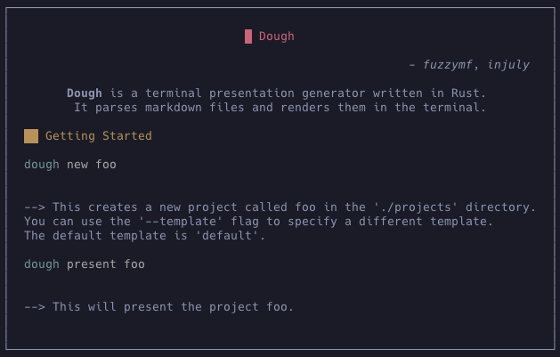
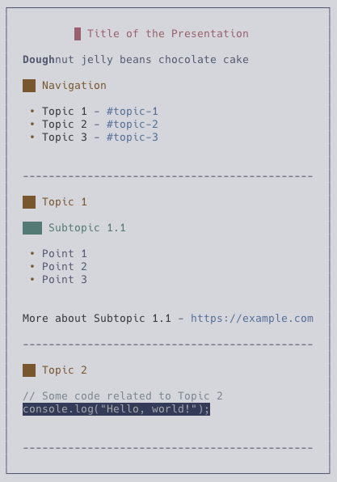

Imagine a presentation tool that seamlessly blends simplicity with power, all while being crafted in Rust. Welcome to Dough – your new favorite presentation companion. Say goodbye to clunky interfaces and hello to a tool that's as intuitive as it is efficient.

<figure class="centered">
<!--  -->

<figcaption>
A simple introduction slide
</figcaption>
</figure>

## Why Dough?

(Why though - *Get it? xD*)

At StackIt, the team gathers every Saturday for their weekly showcase. Each member presents their progress, showcasing the fruits of their week-long hiatus. Inspired by this collaborative spirit, I embarked on a journey to create Dough – a presentation generator tool like no other. Built in Rust, [Dough](https://github.com/fuzzymfx/dough) is a rich, modular, command-line tool to generate presentations. I found similar tools like [slidev](sli.dev) by [antfu](https://antfu.me/) and [presenterm](https://github.com/mfontanini/presenterm) which inspired me to create Dough.

## Unveiling the Core

Dough thrives on markdown, transforming simple text files into captivating slides. Leveraging the syntax of [pulldown-cmark](https://talk.commonmark.org/t/pulldown-cmark-commonmark-in-rust/1205), it effortlessly transforms your ideas into visual stories.

### Create and present projects

With Dough, creating a presentation is as easy as a few keystrokes. Start by initializing a new project or dive straight into presenting an existing one. Templates, the backbone of Dough, allow you to structure your content effortlessly. Each markdown file within a template becomes a slide, ensuring a seamless flow from start to finish.

Dough doesn't believe in a one-size-fits-all approach. Customize your presentations by crafting your own templates. Whether it's a sleek corporate pitch or a whimsical storytelling session, Dough adapts to your style. The default template is a simple, minimalistic design that's easy on the eyes.  

### Multi-Modal presentations

Choose your presentation mode with ease. Whether you prefer the simplicity of the terminal or the allure of HTML, Dough has you covered. While the HTML mode is still in the works, the terminal experience is nothing short of extraordinary.

<figure class="centered">
<!--  -->

<figcaption>
A basic example
</figcaption>
</figure>

### The rendering engine

Projects are created using the `new` command and presented using the `present` command. The `--template` flag can be used to specify the template to be used. The default template is used if not specified. The `--mode` flag can be used to specify the mode to be used. If not specified, the terminal mode is used. The *HTML* mode is not implemented yet.

#### Core

The rendering engine serves as the backbone, seamlessly transforming markdown files into captivating presentations. At the heart of the rendering engine lie two pivotal components:

- Renderer: This component takes charge of the visual rendering of slides.
- Parser: Responsible for dissecting markdown files and converting them into a structured format.

The `present_term` code parses the markdown file, prettifies it, and then passes it to the `renderer` to render it. The `renderer` then renders the slide in the `terminal` to display it.

##### Navigating the Parser's Code

Crafted in Rust, Dough's parser orchestrates the markdown-to-presentation transformation with finesse. Leveraging Rust's robust capabilities alongside libraries like lazy_static, Mutex, HashMap, colored, markdown, and regex, the parser efficiently parses and manipulates content. It dynamically maps markdown elements to styles via a Mutex-guarded HashMap, facilitating flexible customization crucial for rendering. Through recursive traversal of the markdown abstract syntax tree (mdast), it extracts and processes content, highlighting according to the mapped styles. Post-parsing, the content undergoes horizontal and vertical alignment based on flags and markdown text, resulting in visually refined presentations. Seamlessly integrated with the rendering engine, the parser collaborates to deliver an optimal presentation experience, continuously evolving for enhanced parsing accuracy, customization options, and overall presentation quality.

##### Deciphering the Renderer's Code

Dough's rendering logic in Rust orchestrates a seamless presentation experience, blending library prowess with custom structures for efficient project management. Navigation actions, encapsulated in an enum, dictate the flow using upper and lower bounds, allowing users to navigate slides with finesse. Through Termion's wizardry, the terminal becomes a canvas for immersive presentations, where slides materialize and dissolve fluidly in response to user input. In a perpetual loop, Dough's engine gracefully guides users through slides, ensuring an uninterrupted and enchanting presentation journey.

## Contributing

If you're eager to dive into the world of Rust and looking for a project to contribute to, Dough presents an exciting opportunity. Here's a breakdown of what's currently working and what areas could benefit from your expertise:

**What's working and what's not?**

- Improving the rendering engine:
  - ~~Add support for rendering **nested syntax**~~
  - Address the color storage issue for multiline elements, ensuring ANSI escape sequences are properly stripped.
  - Enhance rendering for complex markdown elements like links within headings or lists.
  - Refine color correction post-alignment for a seamless visual experience.
  - Provide comprehensive support for common Markdown syntax, including thematic breaks.
    -Improve the rendering of thematic breaks
  - ~~Improve the design language.~~
  - ~~Image support for terminals with image capabilities is pending. *(Kitty, iTerm2, etc.)*~~
- ~~Syntax Highlighting in code blocks~~
- ~~Custom text alignment: A regex match for individual text alignment - `[\c] - for center, [\l]\ (blank) -default - for left, [\r] - for right`~~
  - Improve the alignment of segments of text.
- Implement running code blocks on separate threads and displaying results in the current console.

Feel free to explore these areas, open new issues, or submit pull requests to contribute to Dough's evolution. Your insights and contributions are highly valued as we strive to make Dough the go-to presentation tool for Rust enthusiasts everywhere. So why wait? Dive into the world of Dough and let your presentations shine like never before.
